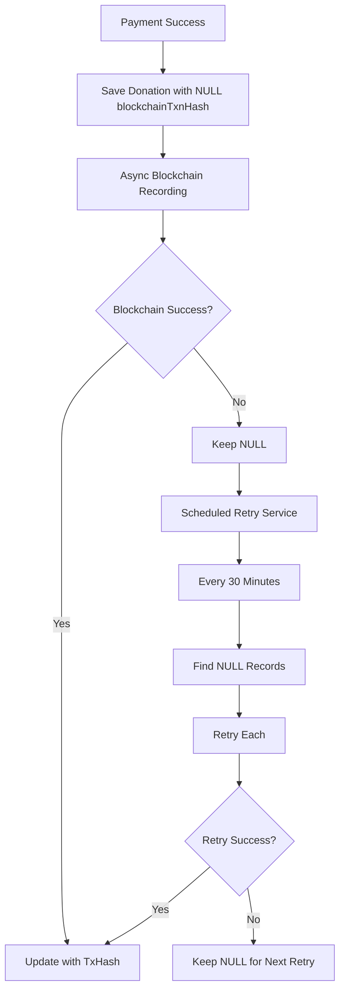

# 🔧 Blockchain Failure Handling Implementation

## ✅ **Complete Failure Handling System**

### **Rules Implemented**
1. ✅ **Donation must still be stored** - Payment flow never fails
2. ✅ **Mark blockchainTxnHash as NULL** - Indicates failed/pending state
3. ✅ **Log comprehensive errors** - SLF4J logging with emojis
4. ✅ **Allow retry mechanism** - Automatic and manual retry options

---

## 🔄 **Updated Failure Handling Flow**

### **Before (String Status)**
```java
// Failed blockchain
donation.setBlockchainTxnHash("FAILED");

// Exception
donation.setBlockchainTxnHash("ERROR");
```

### **After (NULL Handling)**
```java
// Failed blockchain
donation.setBlockchainTxnHash(null);

// Exception  
donation.setBlockchainTxnHash(null);
```

---

## 📊 **Status Values**

| blockchainTxnHash | Meaning | Action |
|-------------------|---------|--------|
| `"0x123..."` | ✅ Success | Complete |
| `null` | ❌ Failed/Pending | Retry |
| `""` (empty) | ⚠️ Invalid | Retry |

---

## 🗄️ **Database Schema Update**

### **Column Definition**
```sql
blockchain_txn_hash VARCHAR(255) NULL DEFAULT NULL
```

### **Entity Update**
```java
@Column(name = "blockchain_txn_hash")
private String blockchainTxnHash; // NULL = failed/pending
```

---

## 🔧 **Service Implementation**

### **1. DonationService Failure Handling**
```java
if (transactionHash != null && !transactionHash.isEmpty()) {
    // Success case
    log.info("✅ Blockchain recording successful for donation {}. TxHash: {}", 
        donation.getDonationId(), transactionHash);
    donation.setBlockchainTxnHash(transactionHash);
    donationRepository.save(donation);
    
} else {
    // Failure case - mark as NULL for retry
    log.error("❌ Blockchain recording failed for donation {}. Marking as NULL for retry.", 
        donation.getDonationId());
    donation.setBlockchainTxnHash(null);
    donationRepository.save(donation);
    log.warn("🔄 Donation {} marked with NULL blockchain hash - ready for retry", 
        donation.getDonationId());
}
```

### **2. Exception Handling**
```java
catch (Exception e) {
    log.error("💥 Exception during blockchain recording for donation {}: {}", 
        donation.getDonationId(), e.getMessage(), e);
    
    try {
        log.warn("🔄 Marking donation {} with NULL blockchain hash due to exception - ready for retry", 
            donation.getDonationId());
        
        donation.setBlockchainTxnHash(null);
        donationRepository.save(donation);
        
        log.info("✅ Donation {} successfully saved with NULL blockchain hash after exception", 
            donation.getDonationId());
        
    } catch (Exception saveException) {
        log.error("🚨 Critical error: Failed to save donation {} even after blockchain exception", 
            donation.getDonationId(), saveException);
    }
}
```

---

## 🔄 **Retry Mechanism**

### **BlockchainRetryService**
```java
@Service
public class BlockchainRetryService {
    
    // Scheduled retry every 30 minutes
    @Scheduled(fixedRate = 30 * 60 * 1000)
    public CompletableFuture<Void> retryFailedBlockchainTransactions() {
        // Find donations with NULL blockchainTxnHash (older than 5 minutes)
        List<Donation> failedDonations = donationRepository
            .findByBlockchainTxnHashNullAndDonatedAtBefore(fiveMinutesAgo);
        
        // Retry each donation
        for (Donation donation : failedDonations) {
            retrySingleDonation(donation);
        }
    }
    
    // Manual retry for specific donation
    public CompletableFuture<Boolean> retrySpecificDonation(Long donationId) {
        // Retry logic with proper error handling
    }
}
```

### **Repository Methods**
```java
// Find donations with NULL blockchainTxnHash
List<Donation> findByBlockchainTxnHashNull();

// Find donations with NULL blockchainTxnHash before time
List<Donation> findByBlockchainTxnHashNullAndDonatedAtBefore(LocalDateTime dateTime);

// Count donations with NULL blockchainTxnHash
long countByBlockchainTxnHashNull();
```

---

## 📝 **Logging Strategy**

### **Log Levels with Emojis**
| Level | Emoji | Usage |
|-------|-------|-------|
| INFO | ✅ | Success operations |
| WARN | ⚠️ | Expected failures |
| ERROR | ❌ | Unexpected failures |
| ERROR | 💥 | Critical exceptions |
| WARN | 🔄 | Retry operations |
| INFO | 📝 | Database updates |
| ERROR | 🚨 | Critical system errors |

### **Log Examples**
```java
// Success
log.info("✅ Blockchain recording successful for donation {}. TxHash: {}", 
    donation.getDonationId(), transactionHash);

// Failure
log.error("❌ Blockchain recording failed for donation {}. Marking as NULL for retry.", 
    donation.getDonationId());

// Exception
log.error("💥 Exception during blockchain recording for donation {}: {}", 
    donation.getDonationId(), e.getMessage(), e);

// Retry
log.warn("🔄 Donation {} marked with NULL blockchain hash - ready for retry", 
    donation.getDonationId());

// Database update
log.info("📝 Updated donation {} with blockchain transaction hash", 
    donation.getDonationId());

// Critical error
log.error("🚨 Critical error: Failed to save donation {} even after blockchain exception", 
    donation.getDonationId(), saveException);
```

---

## 🌐 **REST API Endpoints**

### **BlockchainRetryController**
```java
@RestController
@RequestMapping("/viyom/api/blockchain/retry")
public class BlockchainRetryController {
    
    // Get retry statistics
    @GetMapping("/statistics")
    @PreAuthorize("hasRole('ADMIN')")
    public ResponseEntity<BlockchainRetryStatistics> getRetryStatistics();
    
    // Manual retry for specific donation
    @PostMapping("/donation/{donationId}")
    @PreAuthorize("hasRole('ADMIN')")
    public CompletableFuture<ResponseEntity<String>> retrySpecificDonation(@PathVariable Long donationId);
    
    // Retry all failed transactions
    @PostMapping("/all")
    @PreAuthorize("hasRole('ADMIN')")
    public CompletableFuture<ResponseEntity<String>> retryAllFailedTransactions();
    
    // Health check
    @GetMapping("/health")
    @PreAuthorize("hasRole('ADMIN')")
    public ResponseEntity<String> healthCheck();
}
```

---

## 📈 **Retry Statistics**

### **BlockchainRetryStatistics**
```java
@Data
@Builder
public class BlockchainRetryStatistics {
    private Long totalDonations;
    private Long successfulDonations;
    private Long failedDonations;
    private Long recentFailedDonations;
    private Double successRate;
}
```

### **Statistics API Response**
```json
{
    "totalDonations": 1000,
    "successfulDonations": 950,
    "failedDonations": 50,
    "recentFailedDonations": 5,
    "successRate": 95.0
}
```

---

## 🧪 **Test Coverage**

### **Updated Test Cases**
```java
@Test
void testBlockchainFailureDoesNotBreakPaymentFlow() {
    // Mock blockchain service to return null (failure)
    when(blockchainService.recordDonationOnBlockchain(...))
        .thenReturn(CompletableFuture.completedFuture(null));
    
    // Process payment
    VerifyPaymentResponse response = donationService.verifyPayment(request);
    
    // Payment should still succeed
    assertEquals("SUCCESS", response.getStatus());
    
    // Donation should have NULL status (ready for retry)
    verify(donationRepository, times(1)).save(argThat(savedDonation -> 
        savedDonation.getBlockchainTxnHash() == null
    ));
}

@Test
void testBlockchainExceptionDoesNotBreakPaymentFlow() {
    // Mock blockchain service to throw exception
    when(blockchainService.recordDonationOnBlockchain(...))
        .thenReturn(CompletableFuture.failedFuture(new RuntimeException("Blockchain error")));
    
    // Process payment
    VerifyPaymentResponse response = donationService.verifyPayment(request);
    
    // Payment should still succeed
    assertEquals("SUCCESS", response.getStatus());
    
    // Donation should have NULL status (ready for retry)
    verify(donationRepository, times(1)).save(argThat(savedDonation -> 
        savedDonation.getBlockchainTxnHash() == null
    ));
}
```

---

## 🔄 **Retry Process Flow**



---

## 🚀 **Configuration**

### **Enable Scheduling**
```java
@SpringBootApplication
@EnableScheduling
@EnableAsync
public class ViyomApplication {
    // Application configuration
}
```

### **Async Configuration**
```java
@Configuration
@EnableAsync
public class AsyncConfig {
    
    @Bean
    public TaskExecutor taskExecutor() {
        ThreadPoolTaskExecutor executor = new ThreadPoolTaskExecutor();
        executor.setCorePoolSize(5);
        executor.setMaxPoolSize(10);
        executor.setQueueCapacity(100);
        executor.setThreadNamePrefix("BlockchainRetry-");
        executor.initialize();
        return executor;
    }
}
```

---

## 🔍 **Monitoring**

### **Health Check Endpoint**
```bash
curl http://localhost:8080/viyom/api/blockchain/retry/health
```

### **Response**
```json
{
    "status": "failed_transactions_pending",
    "failedDonations": 5,
    "successRate": 95.5
}
```

### **Statistics Endpoint**
```bash
curl http://localhost:8080/viyom/api/blockchain/retry/statistics
```

---

## 🛡️ **Safety Measures**

### **Donation Integrity**
- ✅ **Never fails payment** - Blockchain issues don't affect main flow
- ✅ **Always saves donation** - Database integrity maintained
- ✅ **Proper error logging** - Full audit trail
- ✅ **Retry capability** - Automatic recovery

### **Data Consistency**
- ✅ **NULL indicates failure** - Clear state management
- ✅ **Transaction hash indicates success** - Verified state
- ✅ **Atomic updates** - Database consistency
- ✅ **Rollback support** - Migration safety

---

## 📋 **Usage Examples**

### **Manual Retry**
```bash
# Retry specific donation
curl -X POST http://localhost:8080/viyom/api/blockchain/retry/donation/123

# Retry all failed
curl -X POST http://localhost:8080/viyom/api/blockchain/retry/all
```

### **Check Statistics**
```bash
curl http://localhost:8080/viyom/api/blockchain/retry/statistics
```

### **Health Check**
```bash
curl http://localhost:8080/viyom/api/blockchain/retry/health
```

---

**🎉 Complete blockchain failure handling with NULL marking, comprehensive logging, and retry mechanism!**
