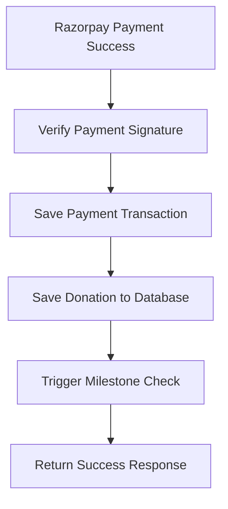
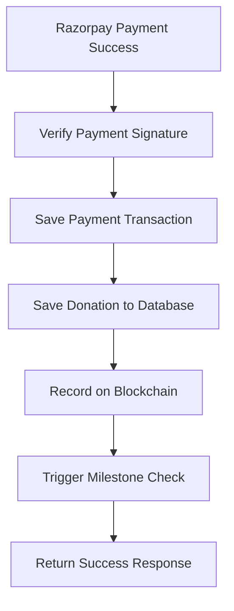

# 🔗 Blockchain Integration in DonationService

## ✅ **Complete Implementation**

### **Integration Point**
Modified `DonationService.verifyPayment()` method to add blockchain recording after payment success.

## 🔄 **Updated Payment Flow**

### **Before Integration**


### **After Integration**


## 📋 **Implementation Steps**

### **1. Add BlockchainService Dependency**
```java
private final BlockchainService blockchainService;
```

### **2. Modify Payment Success Logic**
```java
// Find the created donation
Donation donation = donationRepository.findByPaymentOrder_RazorpayOrderId(request.getRazorpayOrderId())
        .orElseThrow(() -> new RuntimeException("Donation not found after creation"));

// Step 1: Call blockchain service to record donation on blockchain
log.info("Recording donation {} on blockchain after payment success", donation.getDonationId());
recordDonationOnBlockchainAsync(donation);

// Trigger milestone check asynchronously after donation is confirmed
triggerMilestoneCheck(donation);
```

### **3. Implement Blockchain Recording Method**
```java
@Async
@Transactional
public CompletableFuture<Void> recordDonationOnBlockchainAsync(Donation donation) {
    // Prepare blockchain parameters
    String donorEmail = donation.getDonor().getEmail();
    BigDecimal amount = donation.getAmount();
    String category = donation.getDonationPool().getSector().getName();
    String orderId = "DONATION_" + donation.getDonationId();
    Long timestamp = System.currentTimeMillis() / 1000;
    
    // Call blockchain service
    CompletableFuture<String> blockchainFuture = blockchainService.recordDonationOnBlockchain(
            donorEmail, amount, category, orderId, timestamp);
    
    // Handle response and update database
    String transactionHash = blockchainFuture.get();
    if (transactionHash != null && !transactionHash.isEmpty()) {
        donation.setBlockchainTxHash(transactionHash);
        donationRepository.save(donation);
    }
}
```

## 🔒 **Transaction Safety**

### **Async Processing**
- **Non-blocking** - doesn't delay payment response
- **Separate transaction** - independent database transaction
- **Error isolation** - blockchain failures don't affect payment

### **Database Updates**
```java
// Success case
donation.setBlockchainTxHash(transactionHash);
donationRepository.save(donation);

// Failure case
donation.setBlockchainTxHash("FAILED");
donationRepository.save(donation);

// Error case
donation.setBlockchainTxHash("ERROR");
donationRepository.save(donation);
```

### **Status Tracking**
| Status | Meaning | Action |
|--------|---------|--------|
| `"PENDING_BLOCKCHAIN"` | Payment successful, blockchain pending | Recording in progress |
| `"0x123..."` | Blockchain recording successful | Transaction verified |
| `"FAILED"` | Blockchain recording failed | Can be retried |
| `"ERROR"` | Exception occurred | Manual review needed |

## 📊 **Blockchain Parameters**

### **Data Sent to Blockchain**
```java
String donorEmail = donation.getDonor().getEmail();           // Donor identity
BigDecimal amount = donation.getAmount();                     // Donation amount
String category = donation.getDonationPool().getSector().getName(); // Category
String orderId = "DONATION_" + donation.getDonationId();       // Unique order ID
Long timestamp = System.currentTimeMillis() / 1000;          // Timestamp
```

### **Hash Generation**
```java
// Donor privacy protected via SHA-256 hashing
String donorHash = HashUtil.generateDonorHash(donorEmail);
// Example: "a1b2c3d4e5f6789012345678901234567890abcdef1234567890abcdef123456"
```

## 🔄 **Complete Flow Example**

### **Payment Success Scenario**
```java
// 1. Razorpay payment succeeds
VerifyPaymentRequest request = new VerifyPaymentRequest(...);

// 2. Payment verification
boolean isValid = paymentService.verifyPaymentSignature(...);

// 3. If valid, save payment transaction
PaymentTransaction transaction = paymentService.savePaymentTransaction(...);

// 4. Find created donation
Donation donation = donationRepository.findByPaymentOrder_RazorpayOrderId(orderId);

// 5. Record on blockchain (async)
recordDonationOnBlockchainAsync(donation);
    -> blockchainService.recordDonationOnBlockchain(...)
    -> Generate donor hash
    -> Call smart contract
    -> Get transaction hash
    -> Update donation.setBlockchainTxHash(txHash)
    -> Save donation

// 6. Trigger milestone check (async)
triggerMilestoneCheck(donation);

// 7. Return success response
return VerifyPaymentResponse.builder().status("SUCCESS").build();
```

## 🛡️ **Error Handling**

### **Blockchain Service Failure**
```java
if (transactionHash == null || transactionHash.isEmpty()) {
    log.warn("Blockchain recording failed for donation {}. Keeping PENDING status.", 
        donation.getDonationId());
    
    donation.setBlockchainTxHash("FAILED");
    donationRepository.save(donation);
}
```

### **Exception Handling**
```java
catch (Exception e) {
    log.error("Error during blockchain recording for donation: {}", donation.getDonationId(), e);
    
    try {
        donation.setBlockchainTxHash("ERROR");
        donationRepository.save(donation);
    } catch (Exception saveException) {
        log.error("Failed to update donation error status", saveException);
    }
}
```

### **Main Flow Protection**
- **Payment success** is guaranteed regardless of blockchain outcome
- **User experience** is not affected by blockchain failures
- **Data integrity** maintained with proper error states

## 📈 **Performance Considerations**

### **Async Benefits**
- **Fast response** - payment confirmation returned immediately
- **Parallel processing** - blockchain recording runs in background
- **Resource efficiency** - doesn't block main threads

### **Transaction Management**
- **Separate transactions** for payment and blockchain
- **Rollback safety** - blockchain failure doesn't roll back payment
- **Consistency** - database reflects actual blockchain status

## 🧪 **Testing Scenarios**

### **Happy Path**
```java
@Test
void testBlockchainIntegrationSuccess() {
    // Mock blockchain service to return transaction hash
    when(blockchainService.recordDonationOnBlockchain(any(), any(), any(), any(), any()))
        .thenReturn(CompletableFuture.completedFuture("0x123..."));
    
    // Process payment
    VerifyPaymentResponse response = donationService.verifyPayment(request);
    
    // Verify blockchain recording was called
    verify(blockchainService).recordDonationOnBlockchain(any(), any(), any(), any(), any());
    
    // Verify donation was updated with transaction hash
    Donation donation = donationRepository.findById(response.getDonationId()).get();
    assertEquals("0x123...", donation.getBlockchainTxHash());
}
```

### **Blockchain Failure**
```java
@Test
void testBlockchainIntegrationFailure() {
    // Mock blockchain service to return null (failure)
    when(blockchainService.recordDonationOnBlockchain(any(), any(), any(), any(), any()))
        .thenReturn(CompletableFuture.completedFuture(null));
    
    // Process payment
    VerifyPaymentResponse response = donationService.verifyPayment(request);
    
    // Payment should still succeed
    assertEquals("SUCCESS", response.getStatus());
    
    // Donation should have FAILED status
    Donation donation = donationRepository.findById(response.getDonationId()).get();
    assertEquals("FAILED", donation.getBlockchainTxHash());
}
```

## 📋 **Configuration Requirements**

### **Application Properties**
```properties
# Blockchain Configuration
blockchain.polygon.rpc.url=https://rpc-amoy.polygon.technology
blockchain.polygon.chain.id=80002
blockchain.contract.address=YOUR_DEPLOYED_CONTRACT_ADDRESS
blockchain.private.key=YOUR_PRIVATE_KEY
blockchain.gas.price=20000000000
blockchain.gas.limit=6000000
```

### **Spring Boot Configuration**
```java
@EnableAsync  // For @Async support
@Transactional // For transaction management
```

## 🔍 **Monitoring & Logging**

### **Key Log Messages**
```java
// Payment success
log.info("Recording donation {} on blockchain after payment success", donation.getDonationId());

// Blockchain recording start
log.info("Starting blockchain recording for donation: {}", donation.getDonationId());

// Success
log.info("Blockchain recording successful for donation {}. TxHash: {}", donation.getDonationId(), transactionHash);

// Failure
log.warn("Blockchain recording failed for donation {}. Keeping PENDING status.", donation.getDonationId());

// Error
log.error("Error during blockchain recording for donation: {}", donation.getDonationId(), e);
```

## 🚀 **Production Deployment**

### **Pre-deployment Checklist**
- [ ] Deploy smart contract to Polygon Amoy
- [ ] Update contract address in properties
- [ ] Configure private key securely
- [ ] Test blockchain connectivity
- [ ] Verify async processing

### **Post-deployment Monitoring**
- [ ] Monitor blockchain recording success rate
- [ ] Check for ERROR status donations
- [ ] Track gas costs and transaction times
- [ ] Verify frontend blockchain display

---

**🎉 Complete blockchain integration with transaction safety and async processing!**
