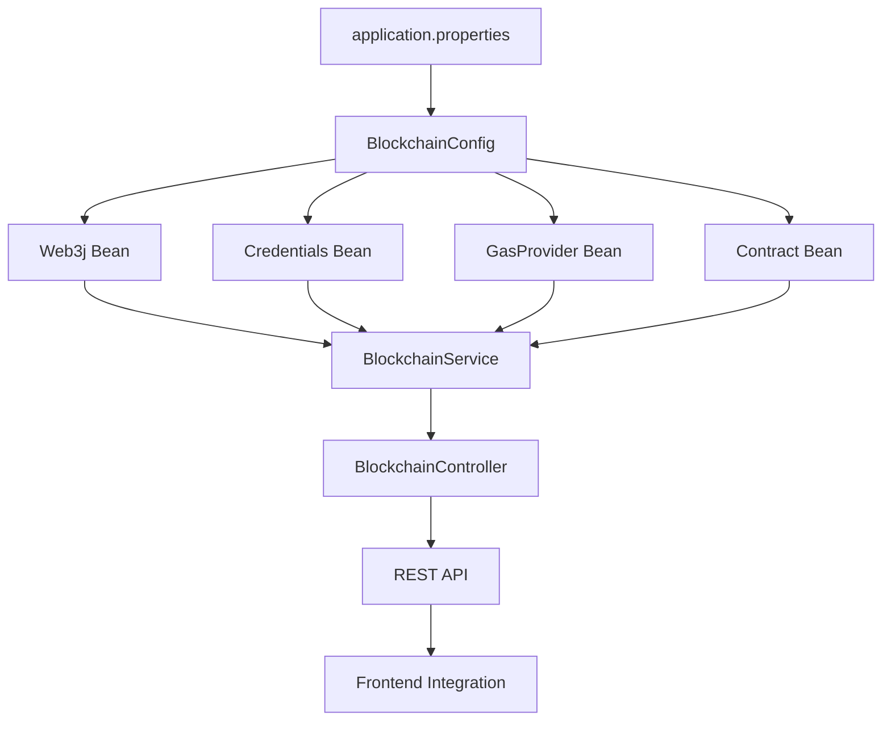

# 🔗 BlockchainConfig Implementation

## ✅ **Complete Implementation**

### **1. Web3j Connection**
```java
@Bean
public Web3j web3j() {
    HttpService httpService = new HttpService(rpcUrl);
    Web3j web3j = Web3j.build(httpService);
    
    // Test connection
    String clientVersion = web3j.web3ClientVersion().send().getWeb3ClientVersion();
    return web3j;
}
```

### **2. Wallet Credentials**
```java
@Bean
public Credentials credentials() {
    if (privateKey == null || privateKey.isEmpty()) {
        log.warn("Private key not configured. Read-only mode enabled.");
        return null;
    }
    
    Credentials credentials = Credentials.create(privateKey);
    return credentials;
}
```

### **3. Gas Provider**
```java
@Bean
public DefaultGasProvider gasProvider() {
    return new DefaultGasProvider(
            BigInteger.valueOf(gasPrice),    // 20 gwei
            BigInteger.valueOf(gasLimit)     // 6M gas limit
    );
}
```

### **4. Smart Contract Bean**
```java
@Bean
public DonationTransparency donationTransparency(
        Web3j web3j,
        Credentials credentials,
        DefaultGasProvider gasProvider) {
    
    DonationTransparency contract = DonationTransparency.load(
            contractAddress,
            web3j,
            credentials,
            gasProvider
    );
    
    return contract;
}
```

## 🔧 **Configuration Loading**

### **application.properties**
```properties
# Blockchain Configuration
blockchain.polygon.rpc.url=https://rpc-amoy.polygon.technology
blockchain.polygon.chain.id=80002
blockchain.contract.address=YOUR_DEPLOYED_CONTRACT_ADDRESS
blockchain.private.key=YOUR_PRIVATE_KEY
blockchain.gas.price=20000000000
blockchain.gas.limit=6000000
```

### **@Value Injection**
```java
@Value("${blockchain.polygon.rpc.url:https://rpc-amoy.polygon.technology}")
private String rpcUrl;

@Value("${blockchain.contract.address:}")
private String contractAddress;

@Value("${blockchain.private.key:}")
private String privateKey;
```

## 🚀 **Spring Bean Integration**

### **Dependency Injection**
```java
@Service
public class BlockchainService {
    
    private final DonationTransparency contract;
    
    public BlockchainService(
            Web3j web3j,
            Credentials credentials,
            DefaultGasProvider gasProvider,
            DonationTransparency donationTransparency) {
        
        this.contract = donationTransparency; // Injected bean
    }
}
```

### **Bean Dependencies**
- **Web3j** → **HttpService** → **RPC URL**
- **Credentials** → **Private Key** → **Wallet**
- **GasProvider** → **Gas Price/Limit** → **Transaction Cost**
- **Contract** → **All Above** → **Smart Contract**

## 📊 **Available Beans**

| Bean Name | Type | Purpose |
|-----------|------|---------|
| `web3j` | `Web3j` | Blockchain connection |
| `credentials` | `Credentials` | Wallet management |
| `gasProvider` | `DefaultGasProvider` | Gas configuration |
| `donationTransparency` | `DonationTransparency` | Contract interaction |
| `contractAddress` | `String` | Contract address |
| `chainId` | `Long` | Network ID |
| `rpcUrl` | `String` | RPC endpoint |
| `isTransactionEnabled` | `Boolean` | Transaction capability |

## 🔌 **REST API Endpoints**

### **BlockchainController**
```java
@RestController
@RequestMapping("/viyom/api/blockchain")
public class BlockchainController {
    
    @GetMapping("/status")                    // Connection status
    @GetMapping("/verify/{txHash}")           // Transaction verification
    @GetMapping("/donation/{orderId}")        // Get donation details
    @GetMapping("/donation/{orderId}/exists") // Check donation exists
    @GetMapping("/donations/total")           // Total donations count
    @PostMapping("/donation")                 // Record donation (test)
    @PostMapping("/allocation")              // Record allocation (test)
}
```

## 🔒 **Security Features**

### **Read-Only Mode**
```java
if (privateKey == null || privateKey.isEmpty()) {
    log.warn("Private key not configured. Read-only mode enabled.");
    return null;
}
```

### **Configuration Validation**
```java
if (contractAddress == null || contractAddress.isEmpty()) {
    throw new IllegalStateException("Contract address not configured");
}
```

### **Transaction Enablement**
```java
@Bean("isTransactionEnabled")
public boolean isTransactionEnabled() {
    return privateKey != null && !privateKey.isEmpty() && 
           contractAddress != null && !contractAddress.isEmpty();
}
```

## 🧪 **Testing & Verification**

### **Connection Test**
```bash
curl http://localhost:8080/viyom/api/blockchain/status
```

### **Contract Loading**
```java
@Test
void testContractLoading() {
    assertNotNull(donationTransparency);
    assertEquals(contractAddress, donationTransparency.getContractAddress());
}
```

### **Transaction Test**
```bash
curl -X POST http://localhost:8080/viyom/api/blockchain/donation \
  -H "Content-Type: application/json" \
  -d '{"donationId":1,"amount":0.1,"donorEmail":"test@example.com"}'
```

## 📈 **Performance Optimization**

### **Gas Configuration**
- **Price**: 20 gwei (optimized for Polygon Amoy)
- **Limit**: 6M gas (sufficient for complex operations)
- **Network**: Polygon Amoy (low fees, fast transactions)

### **Connection Management**
- **HTTP Service**: Reused connections
- **Timeout**: Default Web3j timeouts
- **Retries**: Built-in retry mechanisms

## 🔄 **Integration Flow**



## 🚨 **Error Handling**

### **Configuration Errors**
```java
throw new IllegalStateException("Contract address not configured");
throw new RuntimeException("Failed to connect to blockchain");
throw new RuntimeException("Failed to load smart contract");
```

### **Runtime Errors**
```java
.catchExceptionally(throwable -> {
    log.error("Failed to verify transaction", throwable);
    return ResponseEntity.internalServerError().build();
});
```

## 📋 **Deployment Checklist**

### **Before Deployment**
- [ ] Deploy smart contract to Polygon Amoy
- [ ] Update `blockchain.contract.address` in properties
- [ ] Set `blockchain.private.key` environment variable
- [ ] Verify RPC URL accessibility

### **After Deployment**
- [ ] Test `/blockchain/status` endpoint
- [ ] Verify contract loading
- [ ] Test transaction recording
- [ ] Verify transaction verification

---

**🎉 BlockchainConfig implementation complete with Spring Boot integration!**
