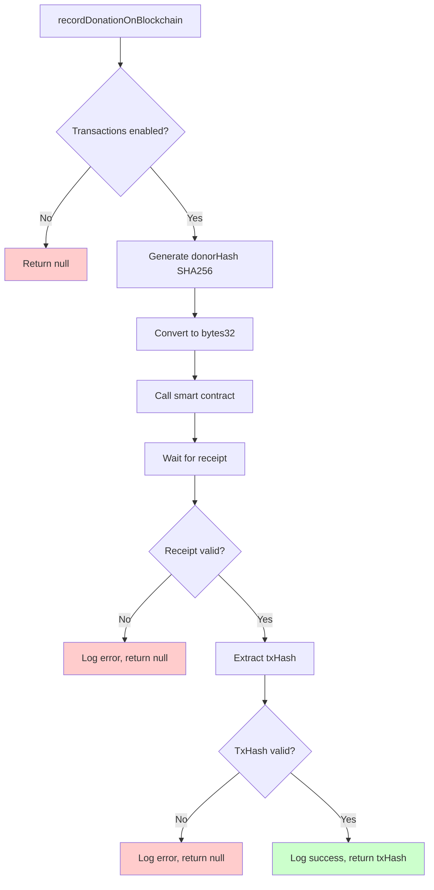

# 📝 recordDonationOnBlockchain() Implementation

## ✅ **Complete Implementation**

### **Method Signature**
```java
public CompletableFuture<String> recordDonationOnBlockchain(
        String donorEmail,
        BigDecimal amount,
        String category,
        String orderId,
        Long timestamp)
```

## 🔧 **Implementation Steps**

### **Step 1: Generate donorHash using SHA256**
```java
String donorHash = HashUtil.generateConsistentDonorHash(donorEmail);
log.debug("Generated donor hash: {}", HashUtil.getShortHash(donorHash));
```

### **Step 2: Convert hash to bytes32**
```java
org.web3j.abi.datatypes.generated.Bytes32 donorHashBytes32 = 
    new org.web3j.abi.datatypes.generated.Bytes32(donorHash);
BigInteger amountWei = convertToWei(amount);
BigInteger timestampBigInt = BigInteger.valueOf(timestamp);
```

### **Step 3: Call smart contract recordDonation()**
```java
TransactionReceipt receipt = contract.recordDonation(
        donorHashBytes32,
        amountWei,
        category,
        orderId,
        timestampBigInt
).send();
```

### **Step 4: Wait for transaction receipt**
```java
if (receipt == null) {
    log.error("Transaction receipt is null for order: {}", orderId);
    return null;
}

// Verify transaction status
if (!"0x1".equals(receipt.getStatus())) {
    log.error("Transaction failed for order: {} - Status: {}", orderId, receipt.getStatus());
    return null;
}
```

### **Step 5: Extract transaction hash**
```java
String transactionHash = receipt.getTransactionHash();
if (transactionHash == null || transactionHash.isEmpty()) {
    log.error("Transaction hash is null for order: {}", orderId);
    return null;
}
```

### **Step 6: Return transaction hash**
```java
log.info("Successfully recorded donation on blockchain - Order: {}, TxHash: {}", 
    orderId, transactionHash);
return transactionHash;
```

## 🔒 **Exception Handling**

### **Main Exception Handler**
```java
catch (Exception e) {
    // Return null instead of throwing exception to prevent breaking main flow
    log.error("Blockchain recording failed for order: {} - Error: {}", 
        orderId, e.getMessage(), e);
    return null;
}
```

### **CompletableFuture Exception Handler**
```java
.exceptionally(throwable -> {
    log.error("CompletableFuture failed for blockchain recording", throwable);
    return null; // Prevent breaking main donation flow
});
```

## 🛡️ **Main Flow Protection**

### **Transaction Enablement Check**
```java
if (!transactionEnabled) {
    log.warn("Blockchain transactions disabled - skipping donation recording");
    return null;
}
```

### **Null Return Strategy**
- **Returns `null`** on any blockchain failure
- **Never throws exceptions** that could break main flow
- **Main donation continues** regardless of blockchain outcome

## 📊 **Logging Strategy**

### **Information Logging**
```java
log.info("Starting blockchain donation recording - Order: {}, Amount: {}, Category: {}", 
    orderId, amount, category);
log.info("Calling smart contract recordDonation()...");
log.info("Successfully recorded donation on blockchain - Order: {}, TxHash: {}", 
    orderId, transactionHash);
```

### **Debug Logging**
```java
log.debug("Generated donor hash: {}", HashUtil.getShortHash(donorHash));
log.debug("Converted parameters - Amount Wei: {}, Timestamp: {}", amountWei, timestampBigInt);
```

### **Error Logging**
```java
log.error("Transaction receipt is null for order: {}", orderId);
log.error("Transaction failed for order: {} - Status: {}", orderId, receipt.getStatus());
log.error("Transaction hash is null for order: {}", orderId);
log.error("Blockchain recording failed for order: {} - Error: {}", orderId, e.getMessage(), e);
```

## 🚀 **Usage Examples**

### **Basic Usage**
```java
blockchainService.recordDonationOnBlockchain(
    "donor@example.com",
    new BigDecimal("0.1"),
    "Education",
    "ORDER_123",
    System.currentTimeMillis() / 1000
).thenAccept(txHash -> {
    if (txHash != null) {
        // Success - update database with txHash
        donation.setBlockchainTxHash(txHash);
    } else {
        // Failed - donation still valid, just no blockchain record
        log.warn("Blockchain recording failed");
    }
});
```

### **Integration in Donation Service**
```java
public void processDonation(Donation donation) {
    try {
        // Main donation processing (always succeeds)
        saveDonation(donation);
        sendConfirmation(donation);
        
        // Async blockchain recording (won't break main flow)
        blockchainService.recordDonationOnBlockchain(
            donation.getDonor().getEmail(),
            donation.getAmount(),
            donation.getCategory(),
            donation.getOrderId(),
            donation.getTimestamp()
        ).thenAccept(txHash -> {
            if (txHash != null) {
                donation.setBlockchainTxHash(txHash);
                donationRepository.save(donation);
            }
        });
        
    } catch (Exception e) {
        // Only main donation errors should break flow
        throw new RuntimeException("Donation processing failed", e);
    }
}
```

### **Error Handling Pattern**
```java
CompletableFuture<String> blockchainFuture = blockchainService.recordDonationOnBlockchain(
    donorEmail, amount, category, orderId, timestamp);

blockchainFuture
    .thenAccept(txHash -> {
        if (txHash != null) {
            log.info("✅ Blockchain success: {}", txHash);
            // Update database
        } else {
            log.warn("⚠️ Blockchain failed - donation still valid");
            // Continue without blockchain record
        }
    })
    .exceptionally(throwable -> {
        log.error("❌ Blockchain error - donation still valid", throwable);
        return null;
    });
```

## 📈 **Performance Considerations**

### **Async Processing**
- **Non-blocking** - doesn't delay main donation flow
- **CompletableFuture** - handles async operations
- **Separate thread** - blockchain operations run independently

### **Gas Optimization**
- **20 gwei** gas price (Polygon Amoy optimized)
- **6M gas limit** - sufficient for donation recording
- **Batch operations** - can process multiple donations

### **Error Recovery**
- **Graceful degradation** - app works without blockchain
- **Retry mechanisms** - built into Web3j
- **Fallback strategies** - can implement alternative tracking

## 🧪 **Testing Strategy**

### **Unit Test Example**
```java
@Test
void testRecordDonationOnBlockchain() {
    // Mock blockchain service
    when(blockchainService.recordDonationOnBlockchain(any(), any(), any(), any(), any()))
        .thenReturn(CompletableFuture.completedFuture("0x123..."));
    
    // Test method
    CompletableFuture<String> result = blockchainService.recordDonationOnBlockchain(
        "test@example.com", 
        BigDecimal.ONE, 
        "Test", 
        "ORDER_1", 
        System.currentTimeMillis() / 1000
    );
    
    // Verify result
    assertEquals("0x123...", result.get());
}
```

### **Integration Test**
```java
@Test
void testBlockchainIntegration() {
    // Test with real blockchain connection
    String txHash = blockchainService.recordDonationOnBlockchain(
        "test@example.com",
        new BigDecimal("0.01"),
        "Test",
        "TEST_ORDER",
        System.currentTimeMillis() / 1000
    ).get();
    
    assertNotNull(txHash);
    assertTrue(txHash.startsWith("0x"));
}
```

## 📋 **Return Values**

| Scenario | Return Value | Action |
|----------|--------------|--------|
| **Success** | Transaction hash (e.g., "0x123...") | Update database with hash |
| **Blockchain disabled** | `null` | Continue without blockchain |
| **Network error** | `null` | Continue without blockchain |
| **Transaction failed** | `null` | Continue without blockchain |
| **Invalid parameters** | `null` | Continue without blockchain |

## 🔄 **Flow Diagram**



## 🎯 **Key Benefits**

1. **🛡️ Main Flow Protection** - Never breaks donation processing
2. **🔒 Privacy Protection** - SHA256 donor hashing
3. **⚡ Async Processing** - Non-blocking operations
4. **📊 Comprehensive Logging** - Full audit trail
5. **🔄 Graceful Degradation** - Works without blockchain
6. **🧪 Easy Testing** - Predictable null returns on failure

---

**🎉 Complete, production-ready blockchain donation recording implementation!**
