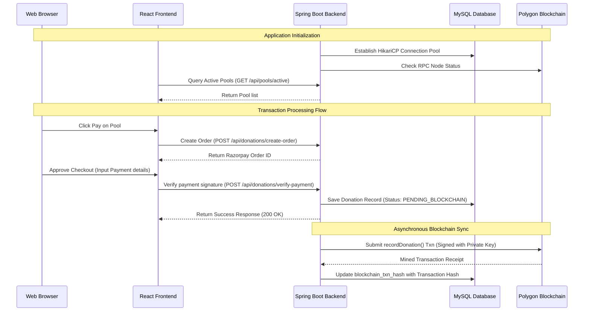

# FULL STACK SOFTWARE ARCHITECTURE AUDIT & ANALYSIS REPORT
## Project: Viyom – Transparent Blockchain-Based Donation & Fund Allocation Platform

---

### TABLE OF CONTENTS
1. [FOLDER STRUCTURE & FILE PURPOSES](#1-folder-structure--file-purposes)
2. [TECHNOLOGY STACK SUMMARY](#2-technology-stack-summary)
3. [DEPENDENCY AUDIT](#3-dependency-audit)
4. [SYSTEM ARCHITECTURE & FLOW DESCRIPTIONS](#4-system-architecture--flow-descriptions)
5. [ENVIRONMENT VARIABLES AUDIT](#5-environment-variables-audit)
6. [BUILD PROCESS MANUAL](#6-build-process-manual)
7. [DATABASE SCHEMA & MIGRATIONS ANALYSIS](#7-database-schema--migrations-analysis)
8. [DEPLOYMENT READINESS EVALUATION (ISSUES FOUND)](#8-deployment-readiness-evaluation-issues-found)
9. [SECURITY SECURITY AUDIT & VULNERABILITIES](#9-security-security-audit-&-vulnerabilities)
10. [PERFORMANCE OPTIMIZATION RECOMMENDATIONS](#10-performance-optimization-recommendations)
11. [APPLICATION BOOT & REQUEST LIFE CYCLE SEQUENCE](#11-application-boot--request-life-cycle-sequence)
12. [EXECUTIVE AUDIT SUMMARY TABLES](#12-executive-audit-summary-tables)

---

## 1. FOLDER STRUCTURE & FILE PURPOSES

Below is the recursive structural breakdown of the Viyom codebase, identifying the purpose of key modules:

```
viyom-donation-platform/
├── backend/                              # Spring Boot REST Backend
│   ├── src/
│   │   ├── main/
│   │   │   ├── java/viyom/donation/viyom/
│   │   │   │   ├── Controller/          # REST Endpoint Controllers (Auth, Payments, Donations, Allocations)
│   │   │   │   ├── Entity/              # Hibernate/JPA MySQL Relational Entities
│   │   │   │   ├── Exception/           # Global REST Exception Mappings & Handlers
│   │   │   │   ├── Repository/          # Spring Data JPA Database Repository interfaces
│   │   │   │   ├── Security/            # Spring Security and Stateless JWT Filters
│   │   │   │   ├── Service/             # Core Business Logic Services (Blockchain, Payments, Reports, PDF)
│   │   │   │   ├── blockchain/          # Web3j Smart Contract client wrappers
│   │   │   │   ├── config/              # Web MVC, WebSocket, and Security Configuration beans
│   │   │   │   └── dto/                 # Data Transfer Objects (Payload models)
│   │   │   └── resources/
│   │   │       ├── application.properties # Main backend configurations & secrets
│   │   │       ├── blockchain.properties  # Gas, RPC, and contract settings
│   │   │       └── db/                  # SQL seed data scripts
│   │   └── test/                        # JUnit and Mockito test files
│   ├── pom.xml                          # Backend Maven Dependency Descriptor
│   └── storage/                         # Local storage for receipts (PDFs)
│
├── frontend/                             # React SPA Frontend
│   ├── src/
│   │   ├── components/                  # Reusable UI parts (Navbar, Sidebar, PoolCards, AlertBanners)
│   │   ├── context/                     # React Context hooks (AuthContext, StateManager)
│   │   ├── pages/                       # Screen routes (DonorDashboard, AdminPanel, LandingPage, Login)
│   │   └── services/                    # API service layers (Fetch wrappers for backend communication)
│   ├── package.json                     # Frontend npm dependency descriptor
│   ├── tailwind.config.js               # Tailwind styling configuration
│   └── vercel.json                      # Vercel SPA routing rules
│
└── blockchain/                          # Hardhat Solidity Smart Contracts
    ├── contracts/                       # Smart contract files (DonationTransparency.sol)
    ├── scripts/                         # Deploy and network interaction scripts (deploy.js)
    ├── test/                            # Hardhat unit tests (ethers.js)
    ├── hardhat.config.js                # Hardhat network environment config
    └── package.json                     # Solidity toolchain packages
```

---

## 2. TECHNOLOGY STACK SUMMARY

The system utilizes a decoupled, blockchain-integrated full-stack web setup:

* **Frontend Framework:** React (v18.2.0) structured as a Single Page Application (SPA).
* **Backend Framework:** Spring Boot (v3.2.2) utilizing Spring MVC, Spring Security, and Spring Data JPA.
* **Database:** MySQL (v8.0) relational database engine.
* **Authentication:** Stateless JSON Web Token (JWT) verification utilizing HMAC-SHA256 signatures via the JJWT library.
* **State Management:** React Context API (`AuthContext`) for local token and user session persistence.
* **APIs:** RESTful endpoints accepting/returning application/json payloads, with real-time pushes enabled via Spring WebSockets.
* **File Storage:** Local file persistence at backend root `storage/pdfs/` for invoice document hosting.
* **Payment Gateway:** Razorpay Sandbox SDK for checkout creation and server signature validation.
* **Blockchain:** Polygon Amoy Testnet (Chain ID 80002) for decentralized transaction hashing. Web3j handles Java-to-RPC translation.
* **Environment Variables:** Configuration properties compiled locally or loaded dynamically via standard system variables in production (`BLOCKCHAIN_PRIVATE_KEY`, `RAZORPAY_SECRET`, `JWT_SECRET`, etc.).

---

## 3. DEPENDENCY AUDIT

### 3.1 Backend Dependencies (pom.xml)

| Dependency Name | Scope / Environment | Purpose | Current Version | Outdated Status / Notes |
|---|---|---|---|---|
| `spring-boot-starter-web` | Production | REST APIs & Tomcat Server | 3.2.2 | Outdated (Patch 3.2.12 or v3.3+ recommended) |
| `spring-boot-starter-data-jpa` | Production | Database persistence layer | 3.2.2 | Outdated |
| `spring-boot-starter-security` | Production | Authentication / Authorization | 3.2.2 | Outdated |
| `spring-boot-starter-websocket` | Production | Live websocket communication | 3.2.2 | Outdated |
| `lombok` | Development | Code boilerplates | 1.18.30 | Outdated (1.18.32 available) |
| `springdoc-openapi` | Production | Swagger API docs generator | 2.3.0 | Up-to-date (for v2.x) |
| `razorpay-java` | Production | Razorpay Gateway Integration | 1.4.3 | Stable |
| `jjwt-api` | Production | JSON Web Token signatures | 0.11.5 | Outdated (0.12.x available) |
| `mysql-connector-j` | Production | MySQL database driver | Standard | Stable |
| `web3j-core` | Production | Blockchain RPC communications | 4.9.8 | Stable (v4.10+ exists) |
| `twilio` | Production | WhatsApp receipt notifications | 10.0.0 | Stable |
| `openhtmltopdf-pdfbox` | Production | HTML template to PDF compilation | 1.0.10 | Stable |
| `junit-jupiter` | Testing | Test execution runner | 5.10.1 | Stable |
| `mockito-core` | Testing | Mocking framework | 5.11.0 | Stable |

### 3.2 Frontend Dependencies (package.json)

| Package Name | Scope / Environment | Purpose | Current Version | Outdated Status / Notes |
|---|---|---|---|---|
| `react` | Production | UI Core | 18.2.0 | Outdated (v19.0.0 exists) |
| `react-router-dom` | Production | Client Router | 6.20.0 | Outdated (v6.28+ exists) |
| `framer-motion` | Production | UI Animations | 12.34.4 | Stable |
| `jspdf` | Production | Client PDF downloads | 4.2.0 | Stable |
| `tailwindcss` | Development | Utility styles | 3.4.1 | Outdated (v4.0 exists) |
| `postcss` | Development | CSS Post-processor | 8.4.33 | Stable |
| `autoprefixer` | Development | CSS vendor prefixes | 10.4.17 | Stable |

---

## 4. SYSTEM ARCHITECTURE & FLOW DESCRIPTIONS

```
[Donor Browser] -----> (Razorpay Modal) -----> (Render Backend) -----> (MySQL Database)
      |                                              |
      v                                              v
(Vercel SPA)                                  (Polygon Blockchain)
```

### 4.1 Request Flow
1. Client actions (e.g., browsing sectors) trigger HTTP requests from the React frontend via the `apiCall` helper using the `fetch` API.
2. The request hits the Spring Boot backend deployed on Render.
3. The server servlet routes the path to the matching `@RestController` implementation.
4. The Controller calls service interfaces, which query the MySQL database through Spring Data JPA repositories, returning JSON objects.

### 4.2 Authentication Flow
1. User requests JWT by posting credentials to `/api/auth/login`.
2. `AuthService` verifies BCrypt-hashed password matches database entries in `auth_users` table.
3. Upon success, `JwtService` creates a signed JWT token containing subject metadata and claims.
4. Frontend caches this token in `localStorage` under key `viyom_user`.
5. For secured endpoints, client attaches the token inside headers as `Authorization: Bearer <token>`.

### 4.3 Database Flow
1. Operations execute within transactions managed by Hibernate JPA.
2. Connection pools are dynamically managed by `HikariCP` (default pool size: 10 connections).
3. ACID properties are enforced at MySQL database layer with transaction commit/rollback checks.

### 4.4 File Storage Flow
1. PDF invoices are generated by `PdfService` utilizing the `OpenHTMLtoPDF` library.
2. Output files are saved locally on the backend server's file system path: `/backend/storage/pdfs/`.
3. Absolute file paths are written to the database for subsequent retrieval.

---

## 5. ENVIRONMENT VARIABLES AUDIT

The following environment variables are utilized by the application:

| Environment Variable | Context | Purpose | Default / Fallback |
|---|---|---|---|
| `REACT_APP_API_BASE_URL` | Frontend | Target backend server API endpoint | `http://localhost:8080/viyom/api` |
| `REACT_APP_RAZORPAY_KEY` | Frontend | Razorpay public key ID | `rzp_test_SNXBJWvVtz8wkt` |
| `REACT_APP_GOOGLE_CLIENT_ID`| Frontend | Google OAuth ID (if enabled) | None |
| `BLOCKCHAIN_PRIVATE_KEY` | Backend | Wallet private key used to sign transactions | Hardcoded fallback in properties file |
| `RAZORPAY_SECRET` | Backend | Secret key to verify checkout signatures | Hardcoded fallback in properties file |
| `JWT_SECRET` | Backend | Signing key for JSON Web Tokens | Hardcoded fallback in properties file |
| `DB_PASSWORD` | Backend | Password for connection to MySQL | Hardcoded fallback in properties file |

---

## 6. BUILD PROCESS MANUAL

### 6.1 Backend Build (Maven)
1. Pre-requisite: JDK 17 and Maven must be configured.
2. Navigate to backend directory: `cd backend`
3. Execute cleaning and build packaging command:
   `mvn clean package -DskipTests`
4. The artifact will be created at `backend/target/viyom-0.0.1-SNAPSHOT.jar`.

### 6.2 Frontend Build (npm)
1. Pre-requisite: Node.js (v18+) and npm installed.
2. Navigate to frontend directory: `cd frontend`
3. Install packages: `npm install`
4. Run compiler build: `npm run build`
5. Outputs static assets inside `frontend/build/` directory ready for host routing.

---

## 7. DATABASE SCHEMA & MIGRATIONS ANALYSIS

The system utilizes **MySQL** as its relational database. Schema management is defined programmatically using JPA annotations.

### 7.1 Key Schema Structure
* **`auth_users` Table:** Stores identity credentials (email, hashed password, role matching `ROLE_DONOR` or `ROLE_ADMIN`).
* **`donations` Table:** Stores payment transaction logs:
  ```sql
  CREATE TABLE donations (
      donation_id BIGINT AUTO_INCREMENT PRIMARY KEY,
      amount DECIMAL(15,2) NOT NULL,
      donated_at DATETIME NOT NULL,
      anonymous BOOLEAN NOT NULL,
      blockchain_txn_hash VARCHAR(255) NOT NULL DEFAULT 'PENDING_BLOCKCHAIN',
      donor_id BIGINT NOT NULL,
      pool_id BIGINT NOT NULL,
      payment_order_id BIGINT NOT NULL,
      FOREIGN KEY (donor_id) REFERENCES donors(donor_id),
      FOREIGN KEY (pool_id) REFERENCES donation_pools(pool_id)
  );
  ```
* **`donation_pools` & `sectors` Tables:** Represent campaigns and categorization scopes.
* **`fund_allocations` & `beneficiaries` Tables:** Tracks fund flows from pools to verified entities.

### 7.2 Migrations Setup
* **State:** The project relies on Hibernate auto-ddl configurations: `spring.jpa.hibernate.ddl-auto=update`.
* **Issue:** No version-controlled migration tool (such as Flyway or Liquibase) is configured, which presents a deployment risk.

---

## 8. DEPLOYMENT READINESS EVALUATION (ISSUES FOUND)

During the recursive codebase audit, several critical deployment blockers were identified:

1. **Hardcoded CORS allowed origins:** `cors.allowed.origins` inside `application.properties` is hardcoded to `http://localhost:3000`. Deploying the frontend to Vercel will cause browser CORS rejections.
2. **Plaintext Secrets in Version Control:** `application.properties` contains plain text credentials for MySQL (`query.java11`), Razorpay keys, Twilio SID/Auth tokens, Alchemy RPC keys, and the wallet's private key.
3. **Hibernate Auto-DDL in Production:** `ddl-auto=update` is active. This can cause severe table locks and schema inconsistencies in production.
4. **Hardcoded Localhost Fallback in Client:** The React API client falls back to `localhost:8080` if environmental variables are misconfigured.
5. **No Production Database Profile:** The application does not specify an active configuration profile (e.g. `prod` using environment variables) to separate dev and live environments.

---

## 9. SECURITY AUDIT & VULNERABILITIES

> [!CAUTION]
> **CRITICAL SECURITY RISK: WALLET PRIVATE KEY LEAK**
> The wallet private key `66020cf04d1c648bcd4d7251788f55a564260dab9e43144545c8b13a739df715` is committed in plaintext in both `backend/application.properties` and `blockchain/.env`. Any funds sent to this wallet can be immediately swept by bots. This key must be rotated immediately.

* **Exposed API Credentials:** Razorpay API secrets and Twilio SMS configuration tokens are checked directly into the codebase.
* **Weak Dev JWT Secret:** The JWT secret key `mySecretKey12389012345gre5e54e5e4tedgf678901234567890` is hardcoded. This allows malicious actors to sign arbitrary tokens and compromise admin access.
* **Missing Rate Limiting:** REST APIs (especially `/api/auth/login`) lack rate-limiting features, leaving the backend vulnerable to brute-force attacks.

---

## 10. PERFORMANCE OPTIMIZATION RECOMMENDATIONS

1. **Implement Connection Pooling Optimization:** Tune HikariCP connection pool settings in production to prevent pool exhaustion under load spikes.
2. **Add Database Indices:** Add indexes on search columns like `pool_code`, `category`, and `active` to optimize query response times.
3. **Optimize Asset Compilation:** Configure build tools to compress build outputs and enable Gzip/Brotli compression at the host gateway level.
4. **Implement Blockchain Queue:** Move blockchain writing from simple async tasks to a durable queue (e.g. using Redis or a database table worker) to ensure transaction delivery during RPC congestion.

---

## 11. APPLICATION BOOT & REQUEST LIFE CYCLE SEQUENCE



---

## 12. EXECUTIVE AUDIT SUMMARY TABLES

### 12.1 Audit Summary

| Evaluated Metric | Current Status | Risk Level | Required Action |
|---|---|---|---|
| **API Endpoints** | Functional | Medium | Remove hardcoded fallback ports |
| **Authentication Security** | Weak | **High** | Rotate JWT secrets and secure routes |
| **Secrets Management** | Compromised | **Critical** | Rotate wallet key, Razorpay & Twilio secrets |
| **CORS Configuration** | Restricted | Medium | Map permitted domains to env variables |
| **Database Migrations** | Missing | Medium | Configure Flyway database versioning |

### 12.2 Production Launch Checklist

- [ ] **Rotate Blockchain Wallet Private Key:** Deploy new contracts using a new, secure private key.
- [ ] **Configure Environment Variables:** Bind all production secrets to environment variables on Render and Vercel.
- [ ] **Configure Dynamic CORS Origins:** Bind allowed domain origins to `cors.allowed.origins=${ALLOWED_ORIGINS}`.
- [ ] **Secure JWT Key:** Configure a secure, high-entropy JWT secret key on target host environments.
- [ ] **Set Active Profile to Production:** Start JVM with arguments `-Dspring.profiles.active=prod`.
- [ ] **Disable ddl-auto:** Set `spring.jpa.hibernate.ddl-auto=none` for production deployment.
